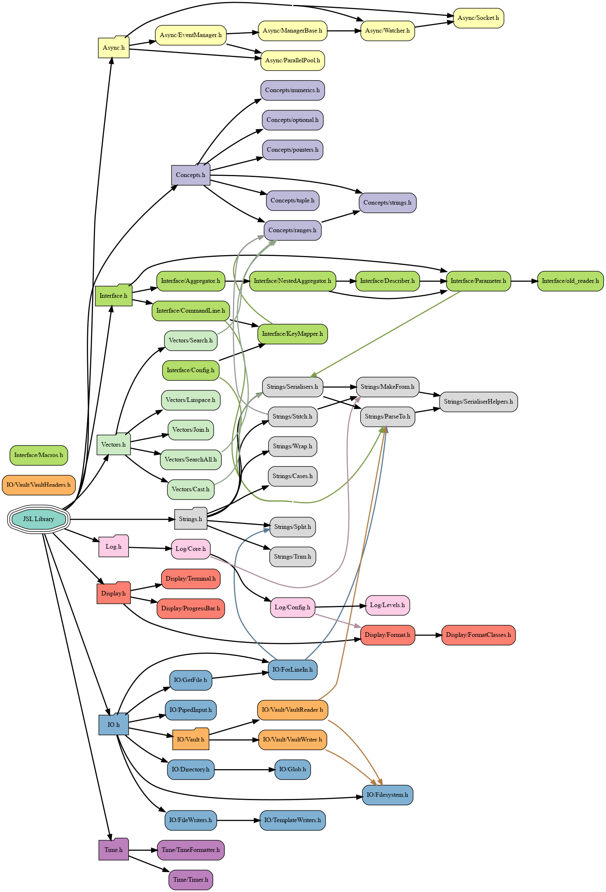
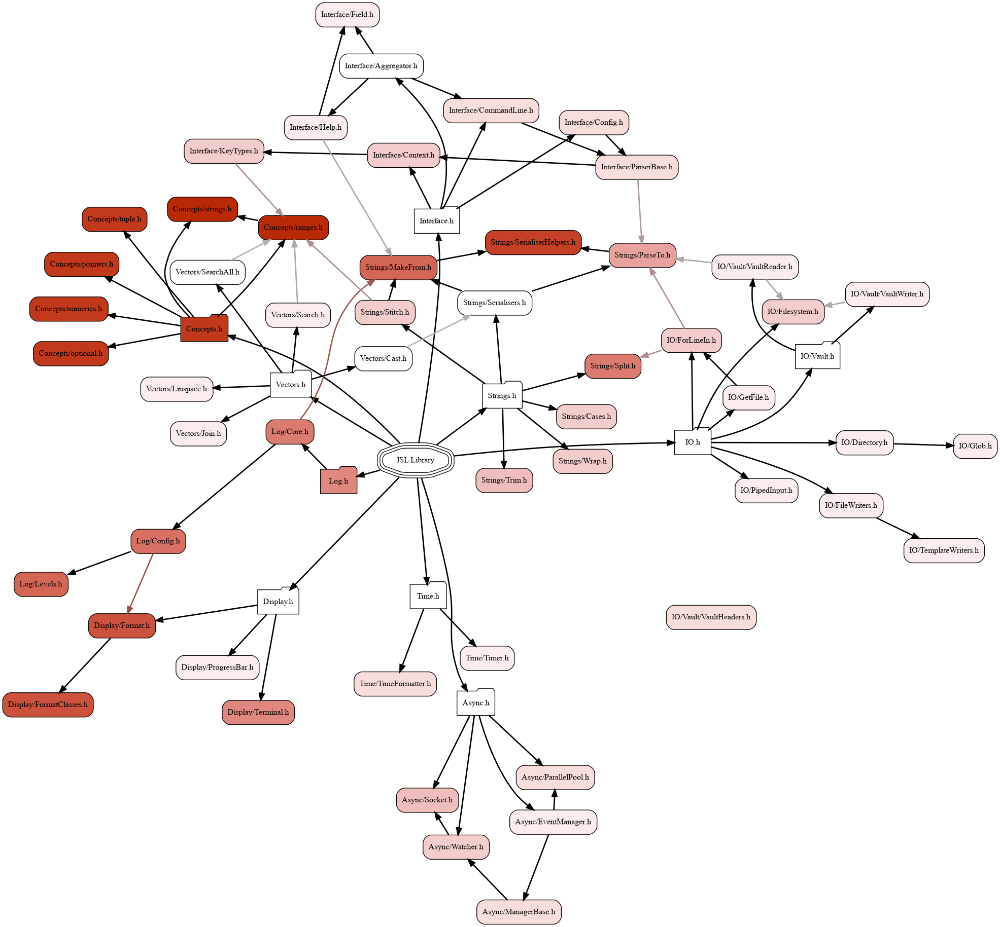

.. JSL documentation master file, created by
   sphinx-quickstart on Thu Aug 19 10:01:35 2021.
   You can adapt this file completely to your liking, but it should at least
   contain the root `toctree` directive.

The JSL 
===============================
 
The JSL ('Jack Standard Library') is a set of tools developed by me (Jack Fraser-Govil) as a uniform, useful set of boilerplate code I found myself duplicating across numerous C++ projects. 
 
Overview
--------------

.. toctree::
	:maxdepth: 2
	:hidden:

	docfiles/style
	Async.h <docfiles/async>
	Display.h <docfiles/display>
	FileIO.h <docfiles/fileio>
	Log.h <docfiles/Log>
	Parameters.h <docfiles/parameters>
	Strings.h <docfiles/strings>
	Time.h <docfiles/time>
	Vector.h <docfiles/vectors>

The entire library can be included with ``#include <JSL.h>`` (provided it is on your include-path), or for a more IWYU-style approach, the individual modules and submodules can be included by ``#include <JSL/[module]>``.
 
.. list-table::
   :header-rows: 1
   :widths: 10 30 50 
   :class: no-wrap 
    
   * - Module
     - Submodules
     - Description

   * - :ref:`Async.h <async>`
     - (not documented) 
     - An asynchronous and parallel computing module

   * - :ref:`Concepts.h <async>`
     - (not documented) 
     - A module for several common template-concepts
      
   * - :ref:`Display.h <display>`
     - * :ref:`Display/Format.h <ansi-format>`
       * :ref:`Display/ProgressBar.h <progress>`
       * :ref:`Display/Terminal.h <terminal>`
     - An ANSI Escape Sequence module, with some other visual tools

   * - :ref:`IO.h <fileio>`
     - * :ref:`IO/Directory.h <directory>`
       * :ref:`IO/Filesystem.h <filesystem>`
       * :ref:`IO/forLineIn.h <forlinein>`
       * :ref:`IO/glob.h <glob>`
       * :ref:`IO/pipedInput.h <pipe>`
       * :ref:`IO/fileWriters.h <file-write>`
       * :ref:`IO/Vault.h <vault>`
     - A file reading and writing submodule 

   * - :ref:`Log.h <log>`
     - * :ref:`Log/Config.h <log-config>`
     - A logging and terminal output module
          
   * - :ref:`Parameter.h <parameters>`
     - (not documented) 
     - A CLI and Settings-aggregtor module
          
   * - :ref:`String.h <strings>`
     - * :ref:`Strings/Cases.h <stringcase>`
       * :ref:`Strings/MakeFrom.h <makestring>`
       * :ref:`Strings/ParseTo.h <parseto>`
       * :ref:`Strings/Stitch.h <joinstring>`
       * :ref:`Strings/Split.h <splitstring>`
       * :ref:`Strings/Trim.h <trimstring>`
       * :ref:`Strings/Wrap.h <textwrap>`
     - A string (and ``std::string_view``) manipulation module, including advanced parsers
          
   * - :ref:`Time.h <time>`
     - * :ref:`Time/Timer.h <stopwatch>`
       * :ref:`Time/TimeFormatter.h <time_format>`
     - A system clock and time-formatting module
        
   * - :ref:`Vector.h <vectors>`
     - * :ref:`Vectors/Cast.h <vectorcast>`
       * :ref:`Vectors/Join.h <vectorjoin>`
       * :ref:`Vectors/Linspace.h <linspace>`
       * :ref:`Vectors/Search.h <searcher>`
     - A vector (and other indexable and iterable range objects) manipulation module

Other utilities included in this documentation include:

 
.. rst-class:: toctree-dense
 
* :ref:`JSL Style Guide<style>`
* Internal documentation
* :ref:`genindex`

Internal Dependencies
++++++++++++++++++++++

	*The overall inclusion heirarchy of the library headers. Colours group together files in the modules and submodules of the library. To avoid excess visual clutter, the connections between* ``Concepts.h`` *to both* ``VaultHeaders.h`` *and* ``SerialiserHelpers.h`` *have been omitted.*

    
  *The inclusion-density of the associated source files: the more intense the colour, the more library source files have to be recompiled when a change is made to the header*
